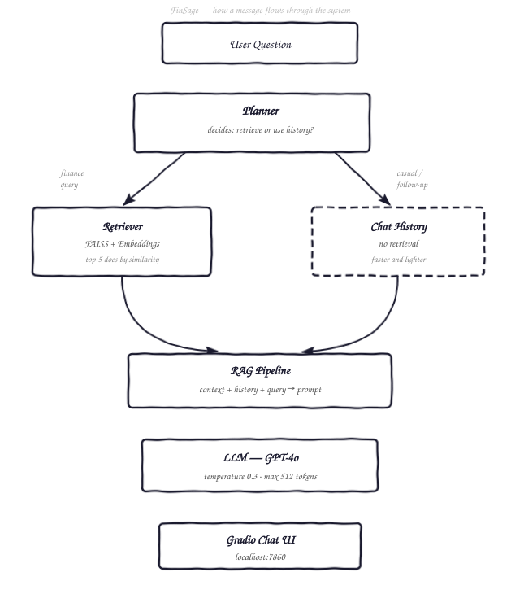

# FinSage — Agentic RAG Financial Advisor

> An AI-powered financial Q&A chatbot that *thinks before it answers.*
> A Planner decides on every turn whether to retrieve knowledge from a
> document base or lean on conversation context — no unnecessary lookups,
> no hallucinated facts.

---

## The Problem This Solves

Most chatbots fall into one of two traps:

| Trap | What goes wrong |
|---|---|
| Always retrieve | Slow, pulls irrelevant docs for simple follow-ups |
| Never retrieve | Hallucinates specific rates, rules, and figures |

Financial advice has zero tolerance for made-up numbers.
FinSage adds a **routing layer** between the user and the LLM that asks
*"does this question need grounded knowledge?"* before every response.
If yes → retrieve and answer with context.
If no → answer from the conversation alone, faster and cleaner.

---

## Architecture



---

## What You Learn Building This

- How **RAG (Retrieval-Augmented Generation)** works end to end
- How to build a **FAISS vector index** with sentence-transformers
- How **agentic routing** reduces unnecessary LLM calls and cost
- How to structure a **modular AI pipeline** where every layer is swappable
- How to manage **conversation history** properly in a stateless way
- How to wire an LLM backend to a **Gradio chat UI**
- Basics of **prompt engineering** — system prompts, context injection, history formatting

---

## Project Structure

```
finsage/
├── agentic_rag_financial_advisor/
│   ├── planner.py       # Routes query → rag or chat_history mode
│   ├── retriever.py     # FAISS vector search with sentence-transformers
│   ├── rag_pipeline.py  # Prompt assembly + LLM call
│   ├── llm.py           # LangChain ChatOpenAI wrapper
│   ├── config.py        # API key loader from env vars
│   └── utils.py         # Chat history cleaner
├── app.py               # Gradio entry point
├── requirements.txt
└── README.md
```

---

## Quick Start

```bash
git clone https://github.com/c-kiplimo/FinSage.git
cd FinSage

python -m venv .venv
source .venv/bin/activate        # Windows: .venv\Scripts\activate

pip install -r requirements.txt

export OPENAI_API_KEY=sk-...     # required
# export ANTHROPIC_API_KEY=...   # optional
# export GEMINI_API_KEY=...      # optional

python app.py                    # opens http://localhost:7860
```

---

## Example Questions to Try

- *"What is an index fund and why should I care?"*
- *"How does dollar-cost averaging work?"*
- *"I have $5,000 saved. Where do I start?"*
- *"What's the difference between a Roth IRA and a traditional IRA?"*
- *"Can you explain that last point more?"*  ← follow-up, no retrieval needed

---

## Tech Stack

| Layer | Library |
|---|---|
| LLM | OpenAI GPT-4o via LangChain |
| Embeddings | `sentence-transformers/all-MiniLM-L6-v2` |
| Vector Search | FAISS (IndexFlatIP, cosine similarity) |
| UI | Gradio ChatInterface |
| Language | Python 3.10+ |

---

## Improvements To Make Later

- [ ] Replace the keyword planner with an **LLM-based intent classifier** for smarter routing
- [ ] Load documents from **PDFs, URLs, or a database** instead of a hardcoded list
- [ ] Add **streaming responses** so the answer appears word by word
- [ ] Store chat history in **SQLite or Redis** for persistence across sessions
- [ ] Add **source citations** — show which document each answer came from
- [ ] Evaluate retrieval quality with **RAGAS** (Retrieval Augmented Generation Assessment)
- [ ] Add a **confidence score** — if retrieval similarity is low, say "I'm not sure"
- [ ] Deploy to **Hugging Face Spaces** for a public demo link
- [ ] Support **document upload** so users can ask questions about their own files

---

## License

MIT
